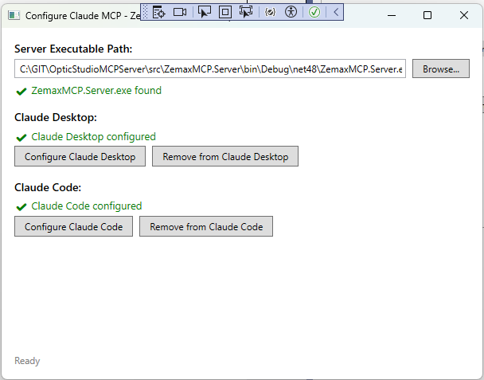
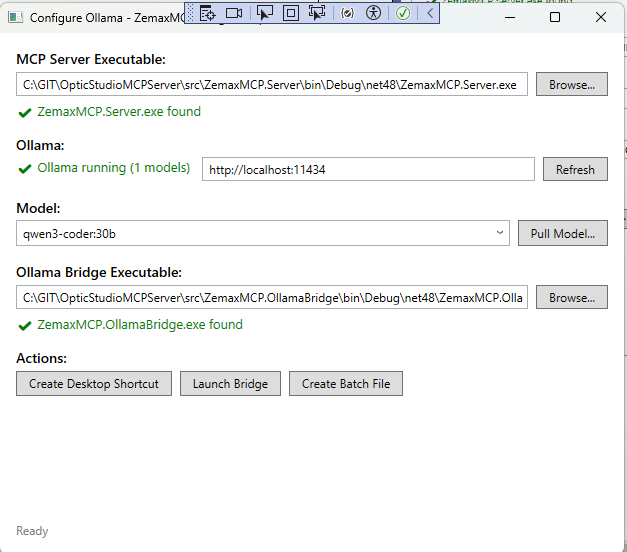
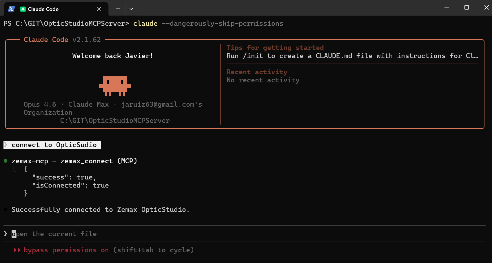
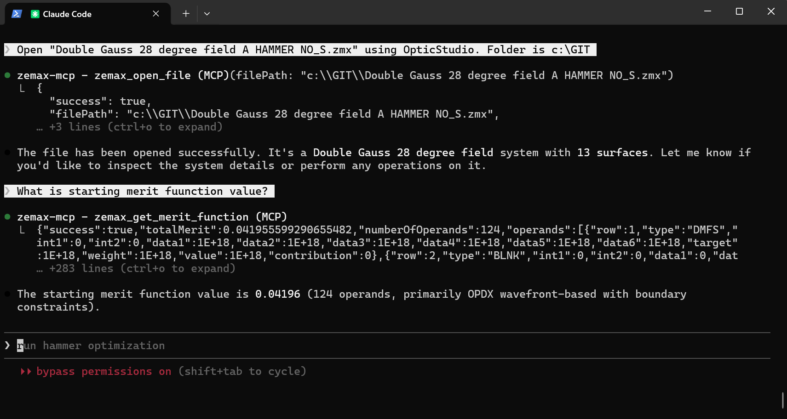
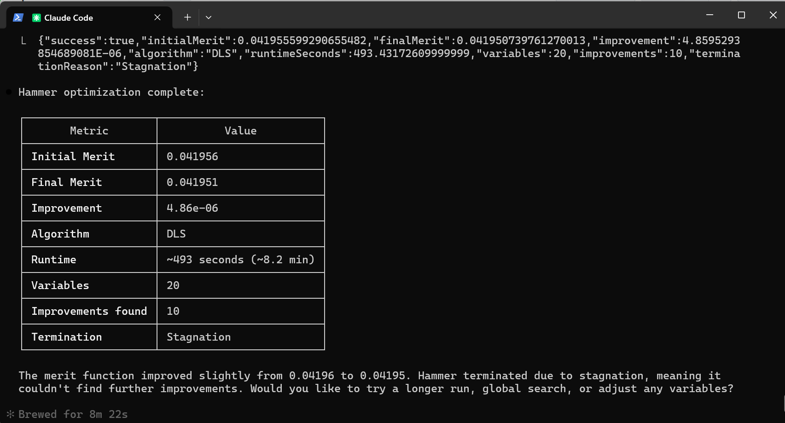

# OpticStudio MCP Server

An MCP (Model Context Protocol) server that enables AI assistants to interact with Zemax OpticStudio for optical design tasks. Works with **Claude Desktop**, **Claude Code**, and **Ollama** (local LLMs).

## Table of Contents

- [Prerequisites](#prerequisites)
- [Quick Start](#quick-start)
- [Step 1: Build the Solution](#step-1-build-the-solution)
- [Step 2: Fix Binaries (Configure ZOS-API Path)](#step-2-fix-binaries-configure-zos-api-path)
- [Step 3: Configure Your AI Client](#step-3-configure-your-ai-client)
  - [Claude Desktop Setup](#claude-desktop-setup)
  - [Claude Code Setup](#claude-code-setup)
  - [Ollama Setup (Local LLMs)](#ollama-setup-local-llms)
- [Connection Modes](#connection-modes)
- [Tool Reference](#tool-reference)
  - [System Tools](#system-tools)
  - [Lens Data Tools](#lens-data-tools)
  - [Analysis Tools](#analysis-tools)
  - [Optimization Tools](#optimization-tools)
  - [Constrained Optimization Tools](#constrained-optimization-tools)
  - [Configuration Tools](#configuration-tools)
  - [System Settings Tools](#system-settings-tools)
  - [Glass Catalog Tools](#glass-catalog-tools)
- [Resources](#resources)
- [Prompts](#prompts)
- [Example Workflow](#example-workflow)
- [Project Structure](#project-structure)
- [Troubleshooting](#troubleshooting)
- [License](#license)

---

## Prerequisites

- **Windows** (required - OpticStudio is Windows-only)
- **.NET Framework 4.8** (included with Windows 10/11)
- **Zemax OpticStudio** with a valid license (any recent version)
- One of the following AI clients:
  - [Claude Code](https://docs.anthropic.com/en/docs/claude-code) (recommended for most users) - see [Installation Guide](docs/INSTALL_CLAUDE_CODE.md)
  - [Claude Desktop](https://claude.ai/download) (GUI alternative) - see [Installation Guide](docs/INSTALL_CLAUDE_DESKTOP.md)
  - [Ollama](https://ollama.com/) (for local/offline LLM usage)

---

## Quick Start

1. **Build** the solution in Visual Studio or via command line
2. **Run FixBinaries** to point the project at your OpticStudio installation
3. **Run ConfigureClaudeMCP** to automatically set up Claude Desktop and/or Claude Code
4. Start using OpticStudio through your AI assistant

---

## Step 1: Build the Solution

Open a Developer Command Prompt or terminal and run:

```
cd C:\GIT\OpticStudioMCPServer
dotnet build
```

Or open `OpticStudioMCPServer.sln` in Visual Studio and build the solution (Ctrl+Shift+B).

This builds all projects:
- **ZemaxMCP.Server** - The MCP server (main executable)
- **ZemaxMCP.Core** - Core library (session management, models)
- **ZemaxMCP.Documentation** - Operand reference database
- **FixBinaries** - ZOS-API path configuration tool
- **ConfigureClaudeMCP** - Claude Desktop/Code setup tool
- **ConfigureOllama** - Ollama bridge setup tool
- **ZemaxMCP.OllamaBridge** - Ollama-to-MCP bridge

---

## Step 2: Fix Binaries (Configure ZOS-API Path)

The MCP server needs to reference three DLLs from your OpticStudio installation: `ZOSAPI.dll`, `ZOSAPI_Interfaces.dll`, and `ZOSAPI_NetHelper.dll`. The **FixBinaries** tool configures this automatically.

### Using the FixBinaries GUI

1. Run `FixBinaries.exe` from `src\FixBinaries\bin\Debug\` (or Release)
2. The tool automatically scans for OpticStudio installations in:
   - `C:\Program Files\Ansys Zemax OpticStudio*`
   - `C:\Program Files\Zemax OpticStudio*`
   - `C:\Program Files\OpticStudio*`
3. Select your installation from the list (or click **Browse** to locate it manually)
4. Verify all three DLLs show green checkmarks:
   - ZOSAPI.dll
   - ZOSAPI_Interfaces.dll
   - ZOSAPI_NetHelper.dll
5. Click **Generate ZemaxPaths.props**

This creates a `ZemaxPaths.props` file at the repository root that tells MSBuild where to find the ZOS-API DLLs. After generating, **rebuild the solution** so the references resolve correctly.

### Manual Alternative

If you prefer, create `ZemaxPaths.props` in the repository root manually:

```xml
<?xml version="1.0" encoding="utf-8"?>
<Project xmlns="http://schemas.microsoft.com/developer/msbuild/2003">
  <PropertyGroup>
    <ZEMAX_ROOT>C:\Program Files\Ansys Zemax OpticStudio 2024 R1\</ZEMAX_ROOT>
  </PropertyGroup>
</Project>
```

Replace the path with your actual OpticStudio installation directory (include trailing backslash).

---

## Step 3: Configure Your AI Client

### Claude Desktop Setup

> **New to Claude Desktop?** See the full [Claude Desktop Installation Guide](docs/INSTALL_CLAUDE_DESKTOP.md) for step-by-step instructions including account creation, downloading, and installation.

#### Using the ConfigureClaudeMCP GUI (Recommended)

1. Run `ConfigureClaudeMCP.exe` from `src\ConfigureClaudeMCP\bin\Debug\`
2. The tool auto-detects `ZemaxMCP.Server.exe` (or click **Browse** to locate it)
3. Click **Configure Claude Desktop**
4. Restart Claude Desktop

The tool edits `%APPDATA%\Claude\claude_desktop_config.json` to add the `zemax-mcp` server entry.



#### Manual Configuration

Edit `%APPDATA%\Claude\claude_desktop_config.json`:

```json
{
  "mcpServers": {
    "zemax-mcp": {
      "command": "C:\\GIT\\OpticStudioMCPServer\\src\\ZemaxMCP.Server\\bin\\Debug\\net48\\ZemaxMCP.Server.exe",
      "args": []
    }
  }
}
```

Restart Claude Desktop after saving.

---

### Claude Code Setup

> **New to Claude Code?** See the full [Claude Code Installation Guide](docs/INSTALL_CLAUDE_CODE.md) for step-by-step instructions including installing Node.js, setting up Claude Code, and signing in.

#### Using the ConfigureClaudeMCP GUI (Recommended)

1. Run `ConfigureClaudeMCP.exe` from `src\ConfigureClaudeMCP\bin\Debug\`
2. Click **Configure Claude Code**
3. The tool runs: `claude mcp add --transport stdio --scope user zemax-mcp -- "path\to\ZemaxMCP.Server.exe"`

#### Manual Configuration (CLI)

```
claude mcp add --transport stdio --scope user zemax-mcp -- "C:\GIT\OpticStudioMCPServer\src\ZemaxMCP.Server\bin\Debug\net48\ZemaxMCP.Server.exe"
```

To verify the server is registered:

```
claude mcp list
```

To remove:

```
claude mcp remove --scope user zemax-mcp
```

#### Skipping Tool Permissions

By default, Claude Code will prompt you to approve each MCP tool call. To skip these prompts and allow all tool calls automatically, start Claude Code with:

```
claude --dangerously-skip-permissions
```

> **Warning:** This bypasses all permission checks. Only use this in trusted environments where you are comfortable with the AI calling OpticStudio tools without confirmation.

---

### Ollama Setup (Local LLMs)

The Ollama Bridge lets you use OpticStudio with local LLMs running on your machine via [Ollama](https://ollama.com/). No cloud API keys needed.

#### Prerequisites

1. Install [Ollama](https://ollama.com/download)
2. Pull a model with tool-calling support:
   ```
   ollama pull llama3.1
   ```
   Other recommended models: `mistral`, `qwen2.5-coder`
3. Make sure Ollama is running: `ollama serve`

#### Using the ConfigureOllama GUI (Recommended)



1. Run `ConfigureOllama.exe` from `src\ConfigureOllama\bin\Debug\`
2. The tool auto-detects:
   - `ZemaxMCP.Server.exe` path
   - `ZemaxMCP.OllamaBridge.exe` path
   - Running Ollama instance and available models
3. Select a model from the dropdown (or pull a new one)
4. Choose an action:
   - **Launch Bridge** - Start an interactive chat session immediately
   - **Create Desktop Shortcut** - Make a shortcut for quick access
   - **Create Batch File** - Save a `.bat` file to launch later

#### Manual Launch (CLI)

Set environment variables and run the bridge:

```
set OLLAMA_MODEL=llama3.1
set OLLAMA_URL=http://localhost:11434
ZemaxMCP.OllamaBridge.exe "path\to\ZemaxMCP.Server.exe"
```

Or pass the server path as a command line argument:

```
ZemaxMCP.OllamaBridge.exe C:\GIT\OpticStudioMCPServer\src\ZemaxMCP.Server\bin\Debug\net48\ZemaxMCP.Server.exe
```

If no model is specified, the bridge will list available models and let you pick one interactively.

#### How the Ollama Bridge Works

The bridge acts as an intermediary:
1. Starts the MCP server as a subprocess (stdio transport)
2. Discovers all available tools from the MCP server
3. Auto-connects to OpticStudio in standalone mode
4. Converts MCP tools to Ollama's tool-calling format
5. Provides an interactive chat loop where the LLM can call OpticStudio tools

Type `tools` during a chat session to list all available tools, or `quit` to exit.

---

## Connection Modes

The MCP server supports two connection modes:

| Mode | Description | Use Case |
|------|-------------|----------|
| **Standalone** (default) | Launches a new OpticStudio instance without UI | Automated workflows, scripting, headless operation |
| **Extension** | Connects to an already-running OpticStudio instance | Interactive use alongside the OpticStudio GUI |

To use **Extension** mode:
1. Open OpticStudio
2. Go to **Programming > Interactive Extension**
3. Tell the AI to connect in extension mode: *"Connect to OpticStudio in extension mode"*

The AI defaults to **standalone** mode unless you explicitly request extension mode.

---

## Tool Reference

### System Tools

| Tool | Description | Parameters |
|------|-------------|------------|
| `zemax_connect` | Connect to OpticStudio | `mode` (opt, default: `"standalone"`): `"standalone"` or `"extension"` · `instanceId` (opt, default: `0`): Instance ID for extension mode |
| `zemax_disconnect` | Disconnect from OpticStudio | *none* |
| `zemax_restart` | Restart the OpticStudio connection | *none* |
| `zemax_status` | Get connection status | *none* |
| `zemax_new_system` | Create a new blank optical system | *none* |
| `zemax_open_file` | Open a .zmx or .zos lens file | `filePath` (**required**): Full path to the lens file |
| `zemax_save_file` | Save the current system | `filePath` (opt): File path; uses current file if omitted |

### Lens Data Tools

| Tool | Description | Parameters |
|------|-------------|------------|
| `zemax_get_system` | Get system data (surfaces, fields, wavelengths) | `includeSurfaces` (opt, default: `true`) · `includeFields` (opt, default: `true`) · `includeWavelengths` (opt, default: `true`) |
| `zemax_get_surface` | Get detailed data for a surface | `surfaceNumber` (**required**): Surface number (0=object, -1=image) |
| `zemax_set_surface` | Modify surface properties | `surfaceNumber` (**required**) · `radius` (opt) · `thickness` (opt) · `material` (opt) · `semiDiameter` (opt) · `conic` (opt) · `comment` (opt) · `isStop` (opt) · `radiusVariable` (opt) · `thicknessVariable` (opt) · `conicVariable` (opt) |
| `zemax_add_surface` | Add a new surface | `insertAt` (opt, default: `0` = before image) · `radius` (opt) · `thickness` (opt) · `material` (opt) · `comment` (opt) |
| `zemax_get_aspheric_surface` | Get aspheric surface data with Even Asphere coefficients | `surfaceNumber` (**required**) |
| `zemax_set_aspheric_surface` | Set Even Asphere coefficients | `surfaceNumber` (**required**) · `conic` (opt) · `conicVariable` (opt) · `alpha1`-`alpha8` (opt): Coefficients · `alpha1Variable`-`alpha8Variable` (opt) |
| `zemax_get_surface_solves` | Get solve/variable/pickup status for a surface | `surfaceNumber` (**required**) |
| `zemax_set_surface_solve` | Set solve type for a surface property | `surfaceNumber` (**required**) · `property` (**required**): `radius`, `thickness`, `conic`, `semiDiameter`, `material`, `param1`-`param8` · `solveType` (**required**): `Fixed`, `Variable`, `Pickup`, `MarginalRayHeight`, etc. · Various solve-specific params (opt) |
| `zemax_set_fields` | Set field points | `fields` (**required**): Array of `{x, y, weight}` · `fieldType` (opt, default: `"Angle"`): `Angle`, `ObjectHeight`, `ParaxialImageHeight`, `RealImageHeight` |
| `zemax_set_wavelengths` | Set wavelengths | `wavelengths` (**required**): Array of `{wavelength (um), weight}` · `primaryWavelength` (opt, default: `1`) |
| `zemax_set_aperture` | Set system aperture | `value` (**required**): Aperture value · `apertureType` (opt, default: `"EPD"`): `EPD`, `FNumber`, `ObjectNA`, `FloatByStop` |

### Analysis Tools

| Tool | Description | Parameters |
|------|-------------|------------|
| `zemax_spot_diagram` | Get spot size analysis | `field` (opt, default: `1`) · `wavelength` (opt, default: `0` = polychromatic) · `rings` (opt, default: `3`) |
| `zemax_fft_mtf` | Calculate FFT MTF for all fields | `frequency` (**required**): Max spatial frequency (cycles/mm) · `wavelength` (opt, default: `0`) · `sampling` (opt, default: `3`, range 1-6) |
| `zemax_geometric_mtf` | Calculate Geometric MTF for all fields | `maxFrequency` (opt, default: `100`) · `wavelength` (opt, default: `0`) · `multiplyByDiffractionLimit` (opt, default: `false`) |
| `zemax_fft_mtf_vs_field` | FFT MTF vs. Y field height for up to 6 frequencies | `frequency1`-`frequency6` (opt, defaults: `10,0,0,0,0,0`) · `sampling` (opt, default: `3`) |
| `zemax_geometric_mtf_vs_field` | Geometric MTF vs. Y field height | `frequency1`-`frequency6` (opt, defaults: `10,0,0,0,0,0`) |
| `zemax_ray_trace` | Trace a ray through the system | `hx`, `hy` (opt, default: `0`): Normalized field coords · `px`, `py` (opt, default: `0`): Normalized pupil coords · `wavelength` (opt, default: `1`) · `surface` (opt, default: `0` = image) |
| `zemax_rms_spot` | Calculate RMS spot size | `hx`, `hy` (opt, default: `0`) · `wavelength` (opt, default: `0`) · `reference` (opt, default: `"centroid"`): `centroid` or `chief` · `sampling` (opt, default: `4`) · `useGrid` (opt, default: `false`) |
| `zemax_cardinal_points` | Get focal lengths, principal planes, etc. | `wavelength` (opt, default: `1`) |
| `zemax_seidel_coefficients` | Get 3rd-order Seidel aberration coefficients | `wavelength` (opt, default: `0` = primary) |
| `zemax_ray_fan` | Transverse ray aberration fan for all fields/wavelengths | *none* |
| `zemax_opd_fan` | Optical path difference fan for all fields/wavelengths | *none* |
| `zemax_pupil_aberration_fan` | Entrance pupil aberration fan | *none* |
| `zemax_chromatic_focal_shift` | Chromatic focal shift vs. wavelength | *none* |
| `zemax_lateral_color` | Lateral color vs. field | *none* |
| `zemax_longitudinal_aberration` | Longitudinal aberration vs. pupil position | *none* |
| `zemax_field_curvature_distortion` | Field curvature and distortion vs. field | `distortionType` (opt, default: `"f_tan_theta"`): `f_tan_theta` or `f_theta` |
| `zemax_relative_illumination` | Relative illumination vs. field angle | *none* |
| `zemax_diffraction_encircled_energy` | FFT diffraction encircled energy | `sampling` (opt, default: `3`) · `useDashes` (opt, default: `false`) |
| `zemax_geometric_encircled_energy` | Geometric encircled energy (ray-based) | `sampling` (opt, default: `4`) · `showDiffractionLimit` (opt, default: `true`) · `scaleByDiffractionLimit` (opt, default: `false`) · `scatterRays` (opt, default: `false`) · `useDashes` (opt, default: `false`) |

### Optimization Tools

| Tool | Description | Parameters |
|------|-------------|------------|
| `zemax_get_merit_function` | Get current merit function | `includeValues` (opt, default: `true`) · `startRow` (opt, default: `0` = all) · `endRow` (opt, default: `0` = all) |
| `zemax_add_operand` | Add operand to merit function | `operandType` (**required**): e.g. `EFFL`, `MTFT`, `RSCE` · `target` (opt, default: `0`) · `weight` (opt, default: `1`) · `insertAt` (opt, default: `0` = append) · `int1`, `int2` (opt) · `data1`-`data6` (opt) |
| `zemax_remove_operand` | Remove a merit function operand | `row` (**required**): Row number (1-indexed) |
| `zemax_optimize` | Run local optimization | `algorithm` (opt, default: `"DLS"`): `DLS` or `Orthogonal` · `cycles` (opt, default: `0` = automatic) |
| `zemax_hammer` | Run Hammer optimization | `algorithm` (opt, default: `"DLS"`) · `cores` (opt, default: `0` = all) · `targetRuntimeMinutes` (opt, default: `1`) · `timeoutSeconds` (opt, default: `120`) · `automatic` (opt, default: `true`) |
| `zemax_global_search` | Run global optimization | `algorithm` (opt, default: `"DLS"`) · `cores` (opt, default: `0` = all) · `solutionsToSave` (opt, default: `10`) · `timeoutSeconds` (opt, default: `60`) |
| `zemax_optimization_wizard` | Auto-construct merit function | `criterion` (opt, default: `"RMSSpotRadius"`) · `reference` (opt, default: `"Centroid"`) · `pupilIntegration` (opt, default: `"GaussianQuadrature"`) · `rings` (opt, default: `3`) · `gridSize` (opt, default: `6`) · `arms` (opt, default: `6`) · `includeAllFields` (opt, default: `true`) · `wavelength` (opt, default: `0`) · and more |
| `zemax_forbes_merit_function` | Forbes 1988 Gaussian quadrature OPD merit function | `operandType` (opt, default: `"OPDX"`): `OPDX`, `OPDC`, or `OPDM` · `rings` (opt, default: `3`) · `arms` (opt, default: `6`) · `includeAllWavelengths` (opt, default: `true`) · `clearExisting` (opt, default: `true`) · and more |
| `zemax_operand_help` | Get help for a specific operand | `operandType` (**required**): e.g. `EFFL` |
| `zemax_search_operands` | Search operands by name/description | `query` (**required**) · `maxResults` (opt, default: `10`) · `category` (opt) |
| `zemax_save_merit_function_file` | Save merit function to .MF file | `filePath` (**required**) |
| `zemax_load_merit_function_file` | Load merit function from .MF file | `filePath` (**required**) |

### Constrained Optimization Tools

Custom MCP-implemented optimization algorithms that run entirely in the MCP server. These are **not** built-in Zemax optimizers — they use ZOSAPI only to get/set variable values and evaluate the merit function, while the optimization logic (Levenberg-Marquardt with bound constraints) runs server-side.

#### Workflow

1. **Identify variables** — Use `zemax_get_variables` to scan the system for all Variable solves and get their variable numbers.
2. **Set constraints** — Use `zemax_set_variable_constraints` to define min/max bounds on variables. Constraints are persisted alongside the .zmx file in a sidecar `.constraints` file and are automatically reloaded when the file is opened.
3. **Optimize** — Run either:
   - `zemax_constrained_optimize` for a single local optimization (blocking), or
   - `zemax_multistart_optimize` for a randomized multistart search (non-blocking).
4. **Monitor** (multistart only) — Poll with `zemax_multistart_status` and cancel with `zemax_multistart_stop`.

#### Tool Reference

| Tool | Description | Parameters |
|------|-------------|------------|
| `zemax_get_variables` | Scan system for all Variable solves and their constraint status | *none* |
| `zemax_set_variable_constraints` | Set min/max bounds on variables | `constraints` (**required**): JSON array of `[{VariableNumber, Constraint, Min, Max}]`. Constraint types: `Unconstrained`, `MinAndMax`, `MinOnly`, `MaxOnly` |
| `zemax_constrained_optimize` | Bound-constrained Levenberg-Marquardt optimization (blocking) | `maxIterations` (opt, default: `200`) · `initialMu` (opt, default: `1e-3`) · `delta` (opt, default: `1e-7`) · `useBroydenUpdate` (opt, default: `true`) · `maxRestarts` (opt, default: `2`) |
| `zemax_multistart_optimize` | Non-blocking multistart optimization with randomized restarts | `maxTrials` (opt, default: `100`) · `lmIterationsPerTrial` (opt, default: `50`) · `initialLmIterations` (opt, default: `200`) · `randomizationPercent` (opt, default: `5.0`) · `constrainedOnly` (opt, default: `false`) · `glassSubstitutionProbability` (opt, default: `0.5`) · `progressInterval` (opt, default: `0`) · `resume` (opt, default: `false`) · `initialMu` (opt, default: `1e-3`) · `delta` (opt, default: `1e-7`) · `useBroydenUpdate` (opt, default: `true`) · `maxRestarts` (opt, default: `0`) |
| `zemax_multistart_status` | Poll progress of a running multistart optimization | *none* |
| `zemax_multistart_stop` | Cancel a running multistart optimization | *none* |

#### Local Optimization (`zemax_constrained_optimize`)

Runs a bound-constrained Levenberg-Marquardt (LM) optimizer. Variables are clamped to their min/max bounds at each iteration. Optionally uses Broyden rank-1 Jacobian updates to reduce the number of merit function evaluations. When Broyden converges early, the optimizer can auto-restart with a fresh Jacobian (controlled by `maxRestarts`).

**Key features:**
- Finite-difference Jacobian with configurable step size (`delta`)
- Broyden rank-1 updates between full Jacobian rebuilds
- Automatic restarts when convergence stalls
- Bound clamping at every iteration

#### Multistart Optimization (`zemax_multistart_optimize`)

Launches a non-blocking multistart search that returns immediately. Each trial randomizes continuous variables within their bound ranges (by `randomizationPercent` of the bound width), optionally substitutes glasses on surfaces with Material Substitute solves, then runs a short LM optimization. The best result across all trials is kept.

**Key features:**
- **Non-blocking** — returns immediately; use `zemax_multistart_status` to poll progress
- **Initial LM phase** — runs a full LM optimization from the current starting point before trials begin
- **Auto-save** — saves improving solutions to a `<filename>_multistart/` folder alongside the original file
- **Constrained-only mode** (`constrainedOnly`) — only randomize variables that have constraints, leaving unconstrained variables at their current best values
- **Glass substitution** — randomly swaps glasses on surfaces with Material Substitute solves at a configurable probability
- **Resume** — continue accumulating trials from a previous run, skipping the initial LM phase
- **Cancellation** — use `zemax_multistart_stop` to gracefully cancel; the optimizer finishes the current trial and restores the best state

### Configuration Tools

| Tool | Description | Parameters |
|------|-------------|------------|
| `zemax_get_configuration` | Get number/current configuration | *none* |
| `zemax_set_number_of_configurations` | Set number of configurations | `numberOfConfigurations` (**required**) |
| `zemax_set_current_configuration` | Set active configuration | `configurationNumber` (**required**, 1-indexed) |
| `zemax_add_configuration_operand` | Add MCE operand | `operandType` (**required**): e.g. `THIC`, `CURV`, `CONI`, `PRAM` · `insertAt` (opt, default: `0`) · `param1`-`param3` (opt) |
| `zemax_delete_configuration_operand` | Delete MCE operand | `row` (**required**, 1-indexed) |
| `zemax_get_configuration_operands` | Get all MCE operands | `startRow` (opt, default: `1`) · `endRow` (opt, default: `0` = all) |
| `zemax_set_configuration_operand_value` | Set MCE operand value or pickup | `operandRow` (**required**) · `configurationNumber` (**required**) · `value` (opt) · `pickupConfig` (opt) · `scaleFactor` (opt) · `offset` (opt) |

### System Settings Tools

| Tool | Description | Parameters |
|------|-------------|------------|
| `zemax_get_ray_aiming` | Get ray aiming setting | *none* |
| `zemax_set_ray_aiming` | Set ray aiming | `rayAiming` (**required**): `Off`, `Paraxial`, or `Real` |
| `zemax_get_afocal_mode` | Get afocal mode setting | *none* |
| `zemax_set_afocal_mode` | Set afocal mode | `afocalMode` (**required**): `true` or `false` |

### Glass Catalog Tools

| Tool | Description | Parameters |
|------|-------------|------------|
| `zemax_get_glass_catalogs` | List available glass catalog names | *none* |
| `zemax_get_glasses` | List glasses with properties (Nd, Vd, dPgF, etc.) | `catalogs` (**required**): Comma-separated catalog names, e.g. `"SCHOTT,OHARA"` |
| `zemax_filter_glasses` | Filter glasses by criteria | `catalogs` (**required**) · `preferredOnly` (opt) · `ndMin`/`ndMax` (opt) · `vdMin`/`vdMax` (opt) · `dpgfMin`/`dpgfMax` (opt) · `maxCost` (opt) · `tceMin`/`tceMax` (opt) · `distanceRadius` (opt): Max weighted distance from target · `ndTarget`/`vdTarget`/`dpgfTarget` (opt) · `wn`/`wa`/`wp` (opt): Weights for distance calc |
| `zemax_export_glass_catalog` | Export filtered glasses to a new .agf file | `catalogName` (**required**) · `sourceCatalogs` (**required**) · `overwrite` (opt, default: `false`) · Plus all filter params from `zemax_filter_glasses` |

---

## Resources

MCP resources provide read-only access to system state:

| Resource | Description |
|----------|-------------|
| `zemax://system` | Current optical system state |
| `zemax://merit-function` | Current merit function |
| `zemax://docs/operands` | Operand documentation |

---

## Prompts

Built-in prompt templates for common workflows:

| Prompt | Description |
|--------|-------------|
| `design_singlet` | Guide for designing a singlet lens |
| `design_doublet` | Guide for designing an achromatic doublet |
| `optimize_mtf` | Guide for MTF optimization |
| `optimize_distortion` | Guide for distortion optimization |
| `optimize_spot_size` | Guide for spot size optimization |
| `analyze_system` | Comprehensive system analysis guide |
| `troubleshoot_design` | Design troubleshooting guide |

---

## Example Workflow

Here is a typical interaction with the AI assistant:

1. **Connect**: *"Connect to OpticStudio"* (uses standalone mode by default)
2. **Open a file**: *"Open C:\Lenses\MyDoublet.zmx"*
3. **Review**: *"Show me the system data"*
4. **Analyze**: *"Run a spot diagram"* or *"Calculate the MTF at 100 cycles/mm"*
5. **Modify**: *"Set surface 2 radius to 50mm and make it variable"*
6. **Optimize**: *"Build an RMS spot merit function and optimize"*
7. **Evaluate**: *"Show me Seidel coefficients and spot size"*
8. **Save**: *"Save the file"*

### Screenshots

**Connecting to OpticStudio from Claude Code:**



**Opening a Zemax file and querying the merit function:**



**Hammer optimization results:**



---

## Project Structure

```
OpticStudioMCPServer/
|-- src/
|   |-- ZemaxMCP.Server/          # MCP server (main executable)
|   |-- ZemaxMCP.Core/            # Core library (session, models, services)
|   |-- ZemaxMCP.Documentation/   # Operand reference database
|   |-- FixBinaries/              # GUI tool to configure ZOS-API DLL paths
|   |-- ConfigureClaudeMCP/       # GUI tool to set up Claude Desktop/Code
|   |-- ConfigureOllama/          # GUI tool to set up Ollama bridge
|   |-- ZemaxMCP.OllamaBridge/    # Ollama-to-MCP bridge (console app)
|-- Directory.Build.props         # Shared build properties
|-- ZemaxPaths.props              # ZOS-API path (generated by FixBinaries)
|-- OpticStudioMCPServer.sln      # Visual Studio solution
|-- README.md
```

---

## Troubleshooting

### "ZOSAPI.dll not found" or build errors

Run **FixBinaries** to generate `ZemaxPaths.props`, then rebuild the solution.

### Tools not loading in Claude

1. Verify the server is registered: `claude mcp list` (for Claude Code)
2. Check `%APPDATA%\Claude\claude_desktop_config.json` (for Claude Desktop)
3. Restart your AI client after configuration changes
4. Check the server log at `src\ZemaxMCP.Server\bin\Debug\net48\logs\`

### "Connection failed" when connecting to OpticStudio

- **Standalone mode**: Make sure OpticStudio is installed and licensed
- **Extension mode**: Open OpticStudio first, then go to **Programming > Interactive Extension** before connecting

### Ollama bridge cannot find the MCP server

Set the `MCP_SERVER_PATH` environment variable to the full path of `ZemaxMCP.Server.exe`, or pass it as the first command-line argument.

### Known Issues

- **`zemax_optimization_wizard`**: May not work correctly in all cases. Use `zemax_forbes_merit_function` or `zemax_add_operand` as alternatives.

---

## License

MIT License - Copyright (c) 2026 Javier A Ruiz. See [LICENSE](LICENSE) for details. Note: A valid Zemax OpticStudio license is required for operation.
